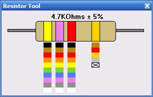



## Resistor Tool

### Description

A simple tool for decoding resistor colour codes. I made this just because someone recently submitted a complex *text* based application (with no colours!) to do the same thing. There are a few of these already here on PSC but all the ones I looked at still used drop down combo boxes to select the name (thats still text!) of the colour. Thomas, I hope its ok that I borrowed your resistor.
 
### More Info
 

             |
---                |---
**Submitted On**   |2007-09-23 22:04:54
**By**             |[Paul Bahlawan](https://github.com/Planet-Source-Code/PSCIndex/blob/master/ByAuthor/paul-bahlawan.md)
**Level**          |Beginner
**User Rating**    |4.7 (14 globes from 3 users)
**Compatibility**  |VB 5\.0, VB 6\.0
**Category**       |[Miscellaneous](https://github.com/Planet-Source-Code/PSCIndex/blob/master/ByCategory/miscellaneous__1-1.md)
**World**          |[Visual Basic](https://github.com/Planet-Source-Code/PSCIndex/blob/master/ByWorld/visual-basic.md)
**Archive File**   |[Resistor\_T2084429232007\.zip](https://github.com/Planet-Source-Code/paul-bahlawan-resistor-tool__1-69382/archive/master.zip)

